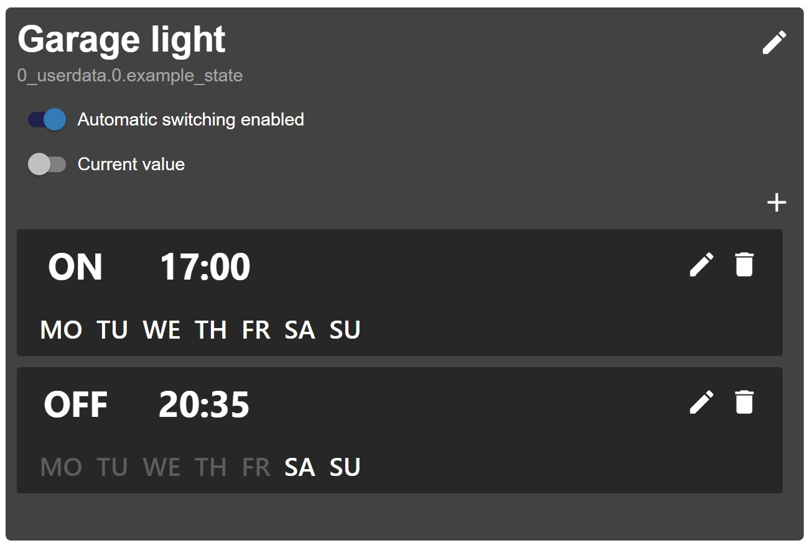

# ioBroker.time-switch

**Tests:**: 

## time-switch adapter for ioBroker

This adapter allows the user to switch devices on and off using time schedules. 
The schedules can be fully configured by a vis widget.
One schedule switches one or more ioBroker states and consists of one or more triggers that define when and how the state should be switched. 
It is possible to configure at which time and on which weekdays the trigger should be triggered. There can be custom on/off values also.
In the widget the schedule can be disabled temporarily and the switched state can be controlled manually.

## Setup

[Setup instructions (english)](doc/Setup.en.md)
[Einrichten des Adapters (deutsch)](doc/Setup.de.md)
     
## Possible features in the future

- Translations for schedule widget
- Astro actions (switch on sunrise, etc.)
- Conditional actions
- Switching of arbitrary values

## Changelog

### 1.1.0
* (walli545) 
    * New option to hide switched oid in widget (#20)
    * Fixed admin page not working on Firefox (#18)
    * Showing full schedule oid in admin page (e.g. time-switch.0.schedule0 instead of schedule0).

### 1.0.0
* (walli545) initial release, features:
    * Admin settings to create schedules
    * vis widget to edit schedules and add actions
    

## License
MIT License

Copyright (c) 2019-2020 walli545 <walli5446@gmail.com>

Permission is hereby granted, free of charge, to any person obtaining a copy
of this software and associated documentation files (the "Software"), to deal
in the Software without restriction, including without limitation the rights
to use, copy, modify, merge, publish, distribute, sublicense, and/or sell
copies of the Software, and to permit persons to whom the Software is
furnished to do so, subject to the following conditions:

The above copyright notice and this permission notice shall be included in all
copies or substantial portions of the Software.

THE SOFTWARE IS PROVIDED "AS IS", WITHOUT WARRANTY OF ANY KIND, EXPRESS OR
IMPLIED, INCLUDING BUT NOT LIMITED TO THE WARRANTIES OF MERCHANTABILITY,
FITNESS FOR A PARTICULAR PURPOSE AND NONINFRINGEMENT. IN NO EVENT SHALL THE
AUTHORS OR COPYRIGHT HOLDERS BE LIABLE FOR ANY CLAIM, DAMAGES OR OTHER
LIABILITY, WHETHER IN AN ACTION OF CONTRACT, TORT OR OTHERWISE, ARISING FROM,
OUT OF OR IN CONNECTION WITH THE SOFTWARE OR THE USE OR OTHER DEALINGS IN THE
SOFTWARE.
